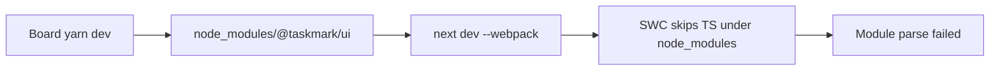

# B-MM-a1d0d6ae: taskmark dev fails with TypeScript module parse errors when the UI is installed under node_modules

## Description

On a consumer board with `@taskmark/ui` 0.4.0 installed, `taskmark dev` starts Next but every page fails to compile. Webpack treats the package sources as plain JavaScript, so TypeScript-only syntax breaks the build:

```text
./lib/theme-cookie.ts
Module parse failed: Unexpected token (6:7)
> export type ThemePreference = "light" | "dark"
```

The same happens for `import { type BoardSearchParams }` in `app/page.tsx` and `} as const` in `lib/site.ts`, and the board answers `GET / 500`.

The sources are correct. The cause is that Next's SWC loader does not transpile TypeScript living under `node_modules`, and `dev` spawns Next with `cwd: packageRoot`, which is `<board>/node_modules/@taskmark/ui` for installed boards. `taskmark build` already works around the same constraint by staging the package to `<board>/.taskmark-ui-build`; `taskmark serve` is unaffected because it runs a prebuilt `.next`. Running `yarn dev` inside the `taskmark-frontend` checkout also works, which is why this was not caught before publishing.



Fix by reusing the build staging pattern for development: extract the staging helper shared with `scripts/build-static.mjs`, copy the app to a board-local `.taskmark-ui-dev` directory (symlinking `node_modules`, preserving `.next` between runs), run Next from there, and write the development reload token onto the stage instead of into `node_modules`. The stage directory must be ignored by the markdown watcher and by board gitignore scaffolding.

The `ENOENT ... 0.pack.gz` webpack cache warnings are a symptom of two Next instances writing `.next` inside the installed package and should disappear once development runs from a board-local stage.

## Repro steps

1. In a board folder with `@taskmark/ui` 0.4.0 installed as a dependency (not the `taskmark-frontend` checkout), run `taskmark dev`.
2. Open the board URL.
3. Every route fails with `Module parse failed: Unexpected token` on TypeScript syntax and `GET / 500`.

## Fix criteria

- [x] `taskmark dev` compiles and serves the board when the package lives under `node_modules`
- [x] Development runs from a board-local stage that is not inside `node_modules`, reusing the staging logic shared with the static build
- [x] The development reload token is written on the stage, and board markdown changes still refresh the UI
- [x] The stage directory is ignored by the markdown watcher and added to board gitignore scaffolding
- [x] `taskmark dev` inside the `taskmark-frontend` checkout still runs in place, and `taskmark build` still stages to `.taskmark-ui-build`

## Prompt & feedback

| When (UTC) | Kind | Author | Summary |
|------------|------|--------|---------|
| 2026-08-31T17:50:00Z | prompt | Marco Mendão | From a Cursor plan: `@taskmark/ui` 0.4.0 breaks `taskmark dev` on a consumer board with TypeScript module parse errors. |
| 2026-08-31T18:16:00Z | prompt | Marco Mendão | Confirm the work is finished and close the leaf. |

## Commits

| SHA | Repo | Date (UTC) | Author | Message |
|-----|------|------------|--------|---------|

## Work log

| Actor | Started (UTC) | Ended (UTC) | Summary |
|-------|---------------|-------------|---------|
| Marco Mendão | 2026-08-31T17:54:03Z | 2026-08-31T18:16:30Z | Staged installed `@taskmark/ui` to `.taskmark-ui-dev` for `taskmark dev`, shared the helper with static build, and verified compile, reload, and in-repo in-place run. |
