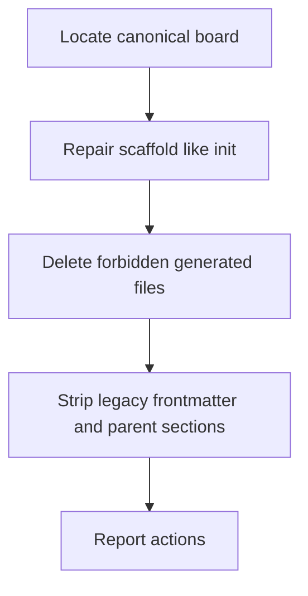

# S-MM-ac500104: Migrate old boards with /tkmd-verify

## User story

As someone with a board created on an older Taskmark, I want `/tkmd-verify` to check the current layout rules, repair the scaffold the way `/tkmd-init` does, delete files that are no longer part of the product, and clean legacy fields from item markdown, so the board matches today’s conventions without a manual rewrite.

## Acceptance criteria

- [ ] The plugin exposes `/tkmd-verify`; it never commits or pushes and never creates `INDEX.md`, `SIZING.md`, `VELOCITY.md`, or `CHANGELOG.md`.
- [ ] It locates the canonical board, repairs UI stubs, gitignore (including `REPOS.md` and `.reports/`), `@taskmark/ui`, and the static project README using the same overwrite rules as init.
- [ ] At the canonical board root it deletes leftover generated files (`INDEX.md`, `SIZING.md`, `VELOCITY.md`, ID counter files) and a nested generated dashboard README when the static README is in the correct place.
- [ ] It strips retired frontmatter from item files and derived child-list/log sections from `epic.md` / `story.md` only, without translating bodies, rewriting IDs, or removing leaf Prompt & feedback, Commits, or Work log.
- [ ] Extra `taskmark/` copies in product repos are reported, not deleted, unless they are clearly generated duplicates of the canonical board.
- [ ] Plugin tests and website command docs cover the command next to `/tkmd-init`.

