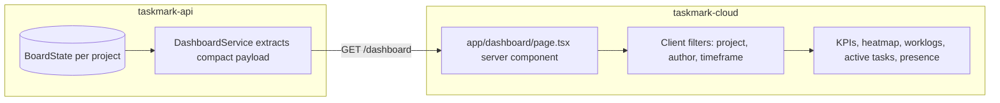

# E-MM-1cc60def: Cloud multi-project dashboard

## Description

Add a `/dashboard` route to Taskmark Cloud with an aggregated view of every project the signed-in user belongs to: worklogs across projects, AI presence summaries per team, a contribution heatmap filterable by author and project, active tasks everywhere, project health cards, and insight widgets (leaderboard, velocity comparison, task-vs-bug split). The view is backed by a new compact `GET /dashboard` aggregation endpoint on taskmark-api so the browser never downloads full 8 MB board snapshots per project.

## Goal

A member opens one Cloud page and sees, across all their projects at once, who is working on what, the work logged recently, points completed over time, and which tasks are active — with filters by author, project, and timeframe.

## Acceptance criteria

- [ ] A `/dashboard` route aggregates every active project of the signed-in user without fetching full board snapshots in the browser.
- [ ] Worklogs, presence summaries, contribution heatmap, active tasks, and project health are all visible on one page.
- [ ] Global filters by project, author, and timeframe apply to every widget.
- [ ] The dashboard is reachable from the Cloud app bar and mobile menu.
