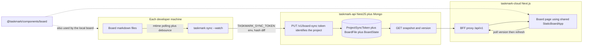

# E-MM-495d489d: Cloud board markdown sync

## Description

Push markdown boards from local Taskmark instances to Taskmark Cloud through the API, store files as the source of truth with a pre-built snapshot cache, and render a read-only hosted board that matches the local UI.

## Goal

Developers share one project sync token, set it as `TASKMARK_SYNC_TOKEN` locally, and see their markdown board appear on Taskmark Cloud as a live read-only mirror.

## Acceptance criteria

- [ ] One opaque sync token per cloud project identifies the destination and authorizes local sync.
- [ ] Local instances send changed markdown files plus a BoardSnapshot cache whenever files change.
- [ ] The hosted board is read-only and reuses the same presentational board UI as the local app.
- [ ] Members can copy the token from project Settings; owners can rotate it.
