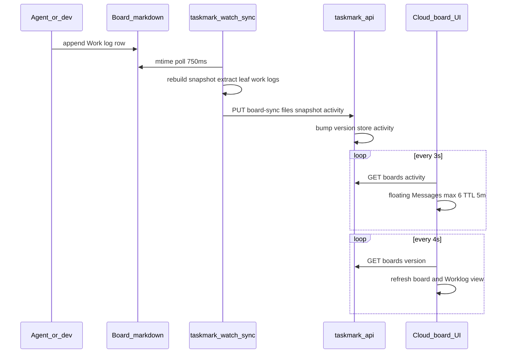

# S-MM-bc1935b3: Live worklog feed across local and cloud boards

## Description

Surface team work-log activity as a floating Cloud feed and as a complete Worklog board view on both local and hosted boards. Reuse the existing markdown watcher and board-version refresh so activity and board content update automatically.

## User story

As a team member, I can see which work teammates are recording now and browse the complete work-log history without opening every item.

## Acceptance criteria

- [ ] Cloud shows at most six floating work-log messages, removes each after five minutes, and evicts the oldest when full.
- [ ] Local and Cloud boards expose a Worklog view containing all leaf work-log rows.
- [ ] The local watcher sends new work-log activity through the existing authenticated sync flow.
- [ ] Cloud members can poll a compact activity endpoint.
- [ ] Full Cloud board content refreshes automatically after sync.
