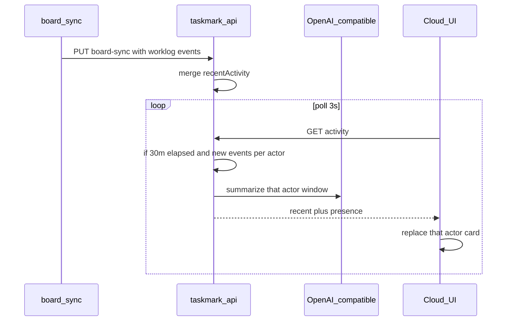

# S-MM-f998c021: Cloud presence summaries from recent worklogs

## Description

Show who is working now on the Cloud board. Keep the left speedometer. On the right, keep the last five worklog bubbles and stack presence cards above them in the same message chrome: one card per person, a quoted present-tense sentence, no item code tag. A later pulse replaces that person's card.

The API lazily summarizes each person's new worklogs every 30 minutes when a member polls activity, so multiple Cloud tabs do not each call the model.

## User story

As a Cloud teammate looking at the board, I want a short “what they are doing now” sentence for each person who recently logged work so I can see current focus without reading every worklog.

## Acceptance criteria

- [ ] Cloud shows presence cards above the floating worklog feed, one card per person, replacing that person on later pulses.
- [ ] Presence is not mixed into stored recent activity and is not shown on the local board.
- [ ] The API refreshes presence at most every 30 minutes, only for actors with new worklogs since the last tick.
- [ ] Cards older than two hours drop off. The sentence is English present tense; without an LLM key the API still returns an extractive fallback.
