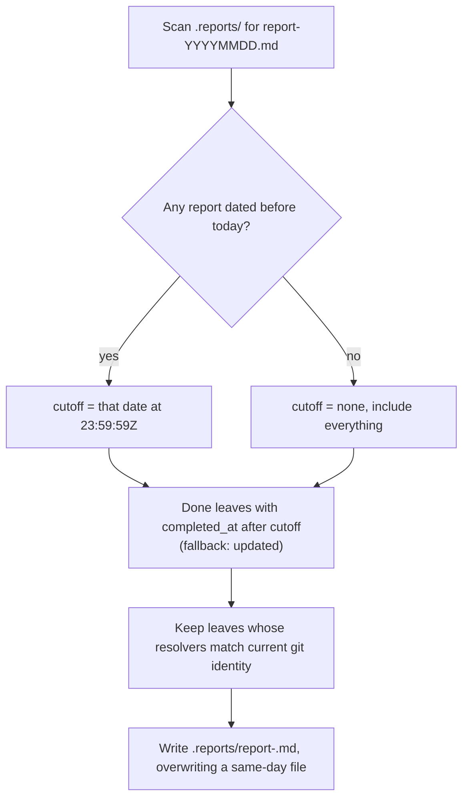

# S-MM-6b6bcec6: Personal report command

## User story

As a contributor, I want to run one command that gathers everything I finished since my last report and writes it as a readable bullet list, so I can say what I did without reading the board or my git history.

## Acceptance criteria

- [ ] `/tkmd-reportme` writes `.reports/report-YYYYMMDD.md` at the board root, creating the directory when it is missing
- [ ] Only done task and bug leaves resolved by the current git identity are included; shelved and cancelled work is excluded
- [ ] The cutoff is the filename date of the newest earlier report; with no earlier report, everything qualifying is included
- [ ] Re-running on the same day overwrites that day's file and still measures from the previous report, so bullets are never duplicated or lost
- [ ] Bullets read like the changelog: past tense, one user-visible outcome each, no `E-`, `S-`, `T-`, or `B-` codes, in the board writing language
- [ ] A run with nothing new still writes the file with a short note instead of inventing bullets
- [ ] The command never commits, never pushes, and never edits epic, story, leaf, or changelog markdown

## Cutoff

