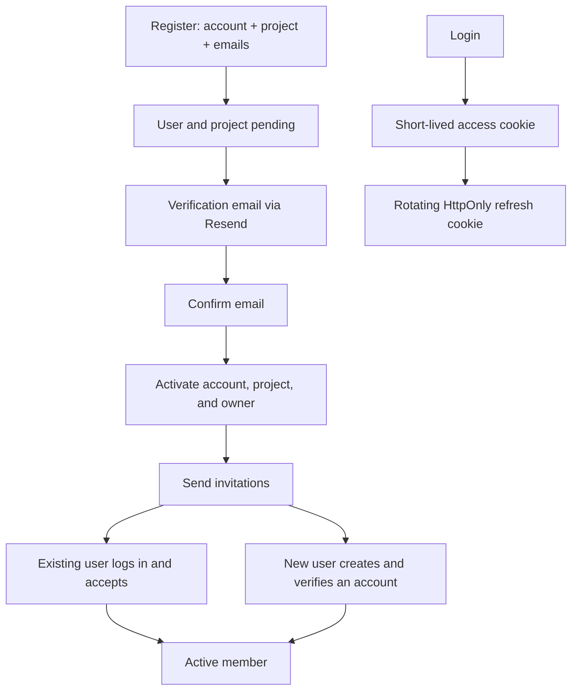

# E-MM-63bde04a: Cloud authentication and registration

## Description

Stand up first-party authentication for Taskmark Cloud: NestJS accounts on MongoDB, a pending project created at signup, email verification, and project invitations sent with Resend. The hosted board itself stays out of scope.

## Goal

A person can register, verify email, sign in with secure cookies, name a first project, and invite others by email without exposing credentials or enumerating accounts.

## Acceptance criteria

- [ ] Registration creates a pending user and pending project and does not start a session.
- [ ] Email verification activates the owner membership and then sends invitations.
- [ ] Login issues rotating HttpOnly access and refresh cookies.
- [ ] Invitations work for both existing and unknown emails.
- [ ] Secrets stay in local env files; no live credentials are committed.
