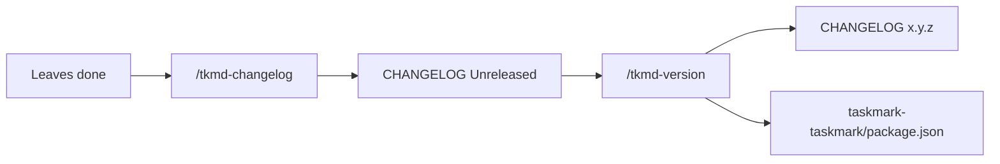

# E-MM-d00339e1: Board changelog and version commands

## Goal

Let maintainers write a human-readable `CHANGELOG.md` on the Taskmark board from recent done work, then cut a version that promotes those notes and bumps the board `package.json` version. Do not reopen E-021 (shelved README changelog).

## Scope

- Agent commands `/tkmd-changelog` and `/tkmd-version` (same style as existing `/tkmd-*`)
- `CHANGELOG.md` at the board root (multi-git: sibling `*-taskmark`; single-git: `<project>/taskmark/CHANGELOG.md`)
- Canonical SemVer on the board project's `package.json` only
- Conventions, always-apply rule, plugin/board READMEs, and website command docs
- Local plugin sync after plugin package changes

## Out of scope

- Changelog in the board README
- Bumping Cursor `plugin.json`, marketplace metadata, or `@taskmark/ui`
- Git tags, GitHub Releases, npm publish
- Auto-running changelog from `/tkmd-do`

## Success metrics

- A visitor can read what changed without work-item IDs
- Unreleased notes accumulate until `/tkmd-version` promotes them
- Board `package.json` version matches the newest changelog section
- `/tkmd-commit` remains the only commit command

